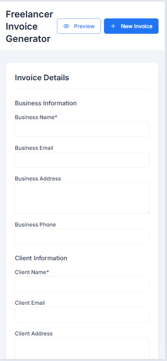

# 🧾 Freelance Invoice Generator

A clean, fast, and simple invoicing tool built for freelancers and small businesses.

Generate professional invoices in seconds — no logins, no fluff, just results.

## 📸 Preview

## ✨ Features

- Realtime invoice preview
- Editable client/business info
- Auto-generated invoice number and date
- Print-ready layout
- Responsive design for desktop and mobile

## 🛠️ Tech Stack

- HTML
- CSS
- JavaScript

## 🚀 How to Use

1. Open the app in your browser.
2. Fill in your business and client details.
3. Add line items and pricing.
4. Click "Print Invoice" to generate a PDF or physical copy.

## 📦 Use Case

Designed for:
- Freelancers
- Consultants
- Side-hustlers
- Anyone who needs a quick invoice without a full SaaS platform

---

